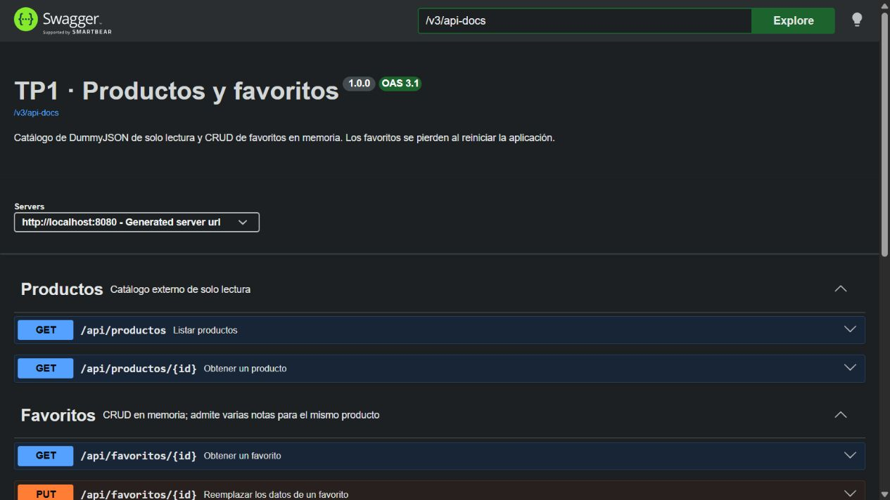
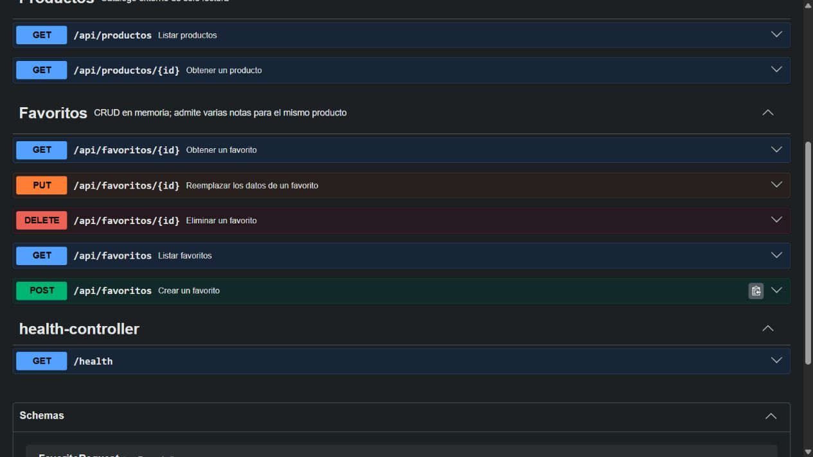

# Evidencia de implementación · TP1

Verificación realizada el 6 de septiembre de 2026, en la rama `TP1`.
Punto de partida: commit `49fab08`, proyecto base con `/health`.

## Compilación y pruebas

Se ejecutó `mvnw.cmd --batch-mode verify` con JDK 25.0.4 y Spring Boot 4.1.1.
Resultado: **BUILD SUCCESS — 46 pruebas, 0 fallas, 0 errores, 0 omitidas**.
El JAR ejecutable se genera en `target/api-blank-0.0.1-SNAPSHOT.jar`.

| Suite | Pruebas | Qué comprueba |
|---|---:|---|
| ApiBlankApplicationTests | 1 | Arranque del contexto Spring |
| HealthControllerTests | 1 | Endpoint base |
| FavoritoRepositoryMemoriaTests | 3 | CRUD, fecha, copia inmutable e IDs concurrentes |
| FavoritoServiceTests | 5 | Mapeo, reloj, actualización y errores con repository mockeado |
| FavoritoControllerTests | 13 | CRUD HTTP, validación, JSON inválido, 404, 405 y 415 |
| ProductoServiceTests | 3 | DTO propio, inexistencia y falla externa |
| ProductoControllerTests | 3 | Contrato público, 404, 502 y solo lectura |
| DummyJsonProductoClientTests | 14 | HTTP real contra servidor local, errores, JSON inválido y timeout |
| ApiIntegrationTests | 3 | CRUD con repositorio real, productos y Swagger/OpenAPI |

Los tests no consultan DummyJSON ni requieren Internet, una vez descargadas las dependencias.
Los mocks solo sustituyen colaboradores en pruebas. En ejecución normal se usa DummyJSON real.

En este Windows se seleccionó explícitamente JDK 25 porque JAVA_HOME apuntaba a Java 21.
También se configuró `jdk.net.unixdomain.tmpdir` con una carpeta sin acentos para evitar
el fallo de loopback del JDK. Los comandos están en el README; no se modificó la configuración global.

## Verificación HTTP de la aplicación empaquetada

Se inició el JAR en 127.0.0.1:8080 con la configuración real de DummyJSON.

| Operación | Resultado observado |
|---|---|
| GET /api/productos | 200, 194 productos con contrato propio |
| GET /api/productos/1 | 200 |
| GET /api/productos/999999999 | 404 |
| POST /api/favoritos válido | 201, ID y fecha generados, header Location |
| POST /api/favoritos con productoId 0 | 400, detalle en campos.productoId |
| DELETE del favorito de prueba | 204 sin cuerpo |
| GET /v3/api-docs | 200, documento OpenAPI |

La cantidad de productos es una observación de esta ejecución, no un valor fijo del contrato.
El favorito de evidencia fue eliminado al terminar la prueba.

Archivos capturados:

- [Resumen HTTP](evidencia/http-resultados.json)
- [Producto: éxito](evidencia/producto-200.json)
- [Producto: inexistente](evidencia/producto-404.json)
- [Favorito: creación](evidencia/favorito-201.json)
- [Favorito: validación](evidencia/favorito-400.json)
- [Exportación OpenAPI](evidencia/openapi.json)
- [Resumen de Maven](evidencia/maven-verify.txt)

## Swagger UI

Se abrió Swagger en el navegador y se verificaron los grupos Productos y Favoritos,
las siete operaciones del TP y los esquemas. Se ejecutó GET /api/productos/1 con
Try it out y se obtuvo 200 con el DTO propio.

Para repetir los casos manuales, ejecutar [tp1.http](tp1.http) en orden.
La caída/timeout del proveedor se reproduce automáticamente con el servidor HTTP local
en DummyJsonProductoClientTests; no requiere provocar una falla en el servicio público.

## Decisiones finales

- DTO de producto: id, nombre, descripcion, precio y categoria.
- Nota opcional, máximo 500 caracteres.
- Sin paginación pública; se consulta todo el catálogo con limit=0.
- 502 ante fallas del proveedor, 404 cuando no existe el producto solicitado.
- Favoritos guardan solo la referencia positiva al producto y admiten duplicados.
- No se verifica existencia contra DummyJSON al guardar favoritos.
- Fecha UTC con Instant y Clock inyectable; se conserva al actualizar.
- Repository en memoria con operaciones atómicas de crear, actualizar y eliminar.
- No se incorporaron JPA, autenticación ni base de datos, conforme al alcance del TP1.
